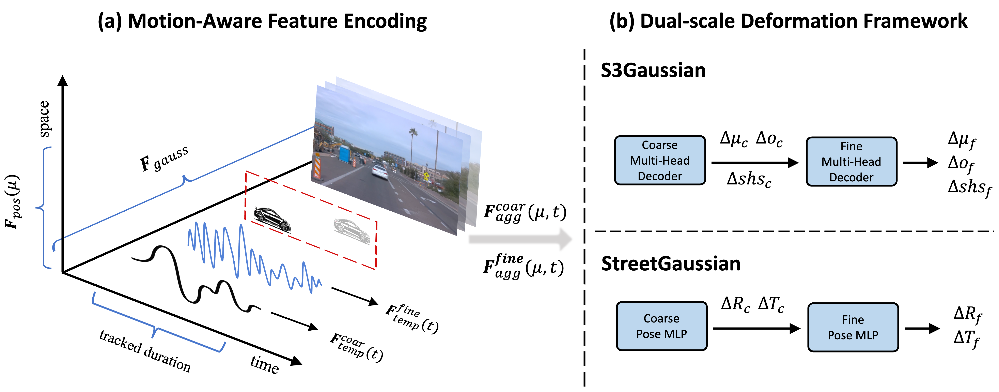

# EMD: Explicit Motion Modeling for High-Quality Street Gaussian Splatting

## News
- **[2025/6/26]** EMD is accepted by ICCV2025! Code will be released soon.

#### [Project Page](https://qingpowuwu.github.io/emdgaussian.github.io/) | [**arXiv Paper**](https://arxiv.org/abs/2411.15582)

## Overview



Photorealistic reconstruction of street scenes is essential for developing real-world simulators in autonomous driving. While recent methods based on 3D/4D Gaussian Splatting (GS) have demonstrated promising results, they still encounter challenges in complex street scenes due to the unpredictable motion of dynamic objects. Current methods typically decompose street scenes into static and dynamic objects , learning the Gaussians in either a supervised manner (e.g., w/ 3D bounding-box) or a self-supervised manner (e.g., w/o 3D bounding-box). However, these approaches do not effectively model the motions of dynamic objects (e.g., the motion speed of pedestrians is clearly different from that of vehicles), resulting in suboptimal scene decomposition. To address this, we propose Explicit Motion Decomposition (EMD), which models the motions of dynamic objects by introducing learnable motion embeddings to the Gaussians, enhancing the decomposition in street scenes. The proposed EMD is a plug-and-play approach applicable to various baseline methods. We also propose tailored training strategies to apply EMD to both supervised and self-supervised baselines. Through comprehensive experimentation, we illustrate the effectiveness of our approach with various established baselines.

## Citation

If you find our work useful for your research, please consider citing:

```bibtex
@article{wei2024emd,
  title   = {EMD: Explicit Motion Modeling for High-Quality Street Gaussian Splatting},
  author  = {Wei, Xiaobao and Wuwu, Qingpo and Zhao, Zhongyu and Wu, Zhuangzhe and Huang, Nan and Lu, Ming and Ma, Ningning and Zhang, Shanghang},
  journal = {arXiv preprint arXiv:2411.15582},
  year    = {2024},
  url     = {https://arxiv.org/abs/2411.15582}
}
